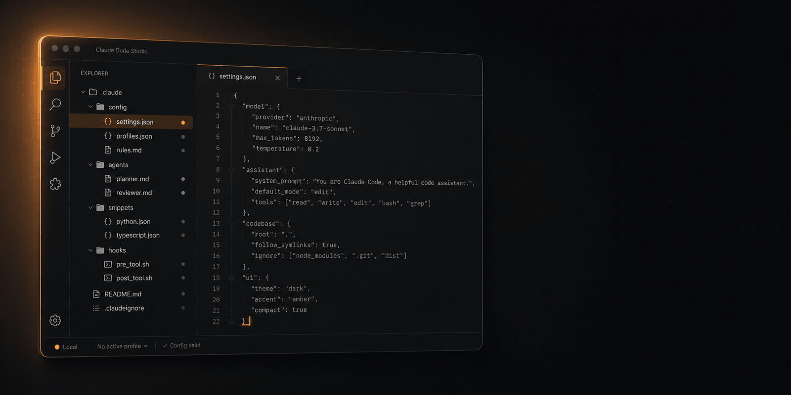
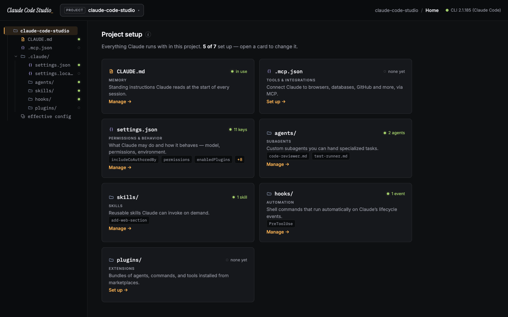
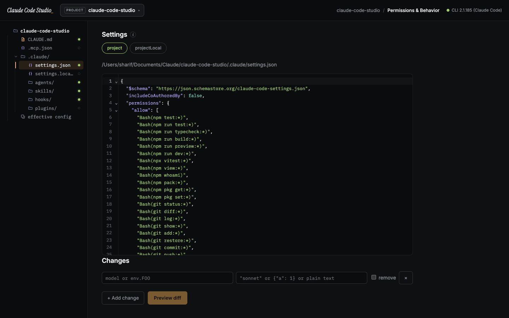
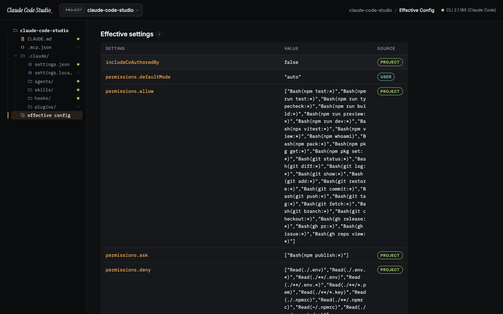
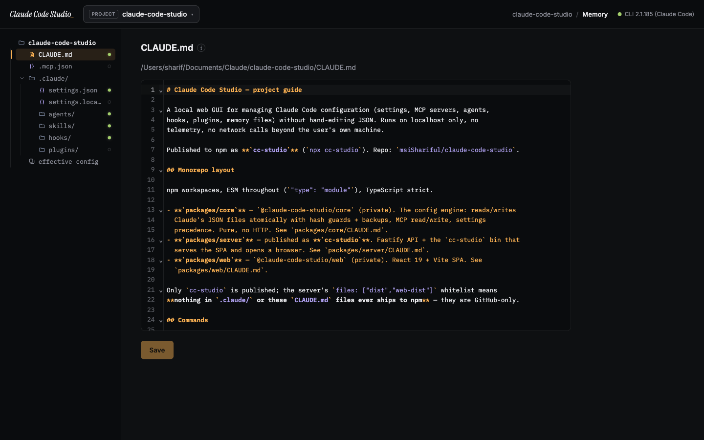
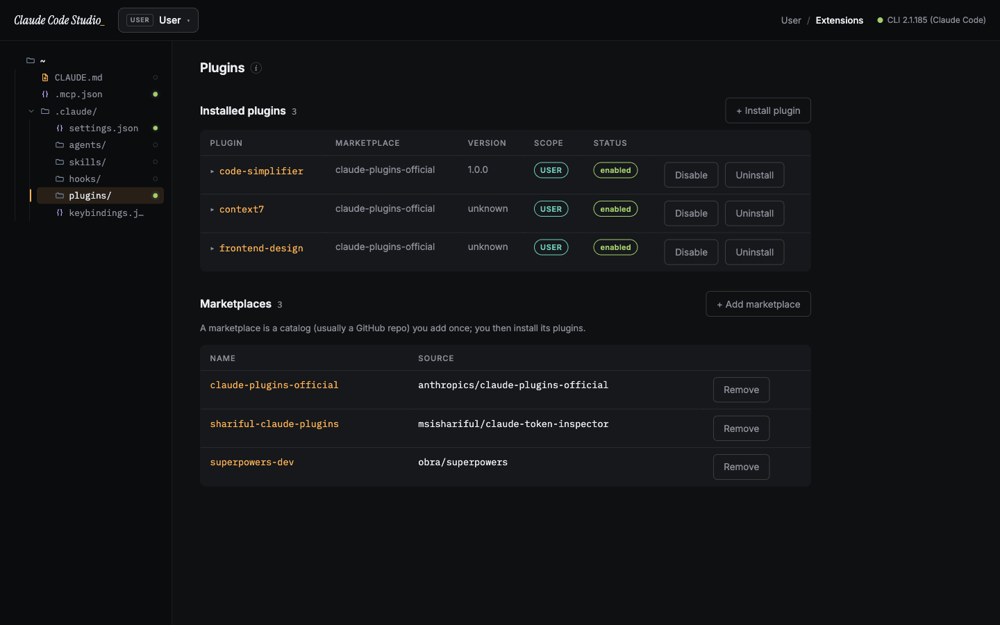

<p align="center">
  
</p>

<h1 align="center">Claude Code Studio</h1>

<p align="center">
  A local, no-telemetry GUI for managing your <a href="https://docs.claude.com/en/docs/claude-code">Claude Code</a> setup —<br/>
  settings, permissions, MCP servers, plugins, hooks, agents, skills, and <code>CLAUDE.md</code> — without hand-editing JSON.
</p>

<p align="center">
  <a href="https://www.npmjs.com/package/cc-studio"></a>
  <a href="https://www.npmjs.com/package/cc-studio"></a>
  <a href="./LICENSE"></a>
  <a href="https://nodejs.org"></a>
  
</p>

<p align="center">
  <code>npx cc-studio</code>
</p>

<p align="center">
  One command starts a localhost-only server and opens the GUI in your browser.<br/>
  Nothing to install, configure, or sign into.
</p>

<p align="center">
  
</p>

---

## Why

Claude Code is configured through a scatter of JSON files across `~/.claude/` and each project — `settings.json`, `.mcp.json`, `settings.local.json`, managed policy, plus plugins, hooks, agents, skills, and `CLAUDE.md` memory. Knowing what's set, where it comes from, and how to change it safely means memorizing precedence rules and editing JSON by hand.

Claude Code Studio is a friendly front end over all of it. It reads and writes the **same files the `claude` CLI uses**, shows you a diff before every change, backs up every file it touches, and explains each concept in plain language — so you can use Claude Code to its full potential even if you've never read the docs.

## Features

- **The `.claude/` tree, as your navigation** — the sidebar mirrors your real config directory (`CLAUDE.md`, `.mcp.json`, `settings.json`, `agents/`, `skills/`, `hooks/`, `plugins/`), with a status dot on everything that's set up. Click a file, edit it.
- **Scope-aware workspaces** — switch between **Global** (everything, aggregated), **User** (your machine-wide `~/.claude` config), and any **Project** (its project + local config). Every screen filters to the scope you're in, so you always know *where* a change lands.
- **Dashboard** — a per-workspace overview of what Claude is set up with, what's missing, and quick links to fix the gaps. Detects the `claude` CLI and flags config-file problems.
- **A real editor** — CLAUDE.md, agents, skills, keybindings, and every JSON config open in a CodeMirror editor with syntax highlighting, line numbers, and code folding.
- **Permissions & behavior** — edit any setting by dotted path (`model`, `env.FOO`, permission rules) with a **color diff preview** before anything is written. Conflicts are detected, never silently overwritten.
- **Effective config** — the merged result of every settings file, each value badged with the scope it comes from; click a value to jump straight to editing it at its source.
- **Tools & integrations (MCP)** — list, add, and remove MCP servers across user/local/project scopes, with a searchable catalog of popular servers and **live connection health** (connected / failed).
- **Extensions (plugins)** — browse and **install real plugins from your marketplaces** with a searchable picker, enable/disable/uninstall, expand any plugin for full details, and manage marketplaces.
- **Automation (hooks)** — browse every lifecycle hook event with plain-English descriptions, see each hook's config, and jump to editing it.
- **History & backups** — every write is snapshotted first; restore any earlier version with one click.

## A look inside

<table>
  <tr>
    <td width="50%" valign="top">
      <a href="assets/settings-editor.png"></a>
      <p><b>Edit settings with a diff.</b> Every JSON config renders with syntax highlighting and folding; changes preview as a color diff before they're written.</p>
    </td>
    <td width="50%" valign="top">
      <a href="assets/effective-config.png"></a>
      <p><b>See the effective config.</b> Every merged value, badged with the scope it comes from — click one to edit it at its source.</p>
    </td>
  </tr>
  <tr>
    <td width="50%" valign="top">
      <a href="assets/claude-md.png"></a>
      <p><b>Write memory and agents.</b> CLAUDE.md, agents, and skills open in a real Markdown editor with highlighting and line numbers.</p>
    </td>
    <td width="50%" valign="top">
      <a href="assets/plugins.png"></a>
      <p><b>Install plugins from marketplaces.</b> Browse, install, enable/disable, and manage the marketplaces they come from.</p>
    </td>
  </tr>
</table>

## Privacy & security

Claude Code Studio is built to be safe to run against your real configuration:

- **Local only.** The server binds to `127.0.0.1` on a random port. Nothing is exposed to your network or the internet.
- **No telemetry, no accounts, no cloud.** It never phones home. The only network calls are the ones *you* trigger (e.g. the `claude` CLI cloning a marketplace).
- **Per-session token.** Every API call requires a token delivered through the launch URL fragment; cross-origin and mismatched-Host requests are rejected.
- **Scoped file access.** The API reads and writes a fixed set of Claude config files — not arbitrary paths — so it can't be aimed at unrelated secrets on disk.
- **Safe writes.** Changes prefer the `claude` CLI where it exists (`claude mcp …`, `claude plugin …`) and otherwise fall back to atomic, hash-guarded file edits — always backing up the previous version first.

See [SECURITY.md](./SECURITY.md) for the full model and how to report a vulnerability.

## Requirements

- **Node.js ≥ 18**
- The **`claude` CLI** is optional but recommended — Studio drives it for MCP and plugin actions and to probe connection health. Without it, those views degrade gracefully and writes fall back to safe file edits.

## How it works

```
┌────────────┐   localhost + token    ┌──────────────────────┐
│  Browser   │ ◀────────────────────▶ │  cc-studio (Fastify) │
│  React SPA │   /#token=…            │  127.0.0.1:<random>  │
└────────────┘                        └──────────┬───────────┘
                                                 │ reads/writes the same files
                                                 │ the claude CLI uses
                                      ~/.claude/ · project/.claude/ · .mcp.json
```

`npx cc-studio` mints a session token, starts the server on a random local port, prints (and opens) a `…/#token=…` URL, and serves the prebuilt UI. The UI talks only to that local server; the server talks only to your local config files and the `claude` CLI.

## Contributing

The repo is an npm-workspaces monorepo (`packages/core`, `packages/server`, `packages/web`), TypeScript throughout, developed test-first.

```bash
git clone https://github.com/msiShariful/claude-code-studio
cd claude-code-studio
npm install

npm test           # full suite across core, server, and web
npm run typecheck  # strict type-check all packages
npm run build      # build all three packages
npm run preview    # build and run the app locally
```

Issues and pull requests are welcome — see the package-level guides in each `packages/*/` directory for architecture and conventions.

## Notes

- Published to npm as **`cc-studio`** (the `claude-code-studio` name was already taken); the product keeps its full name.
- This is an independent, community project and is **not** an official Anthropic product.

## License

[MIT](./LICENSE) © msiShariful
